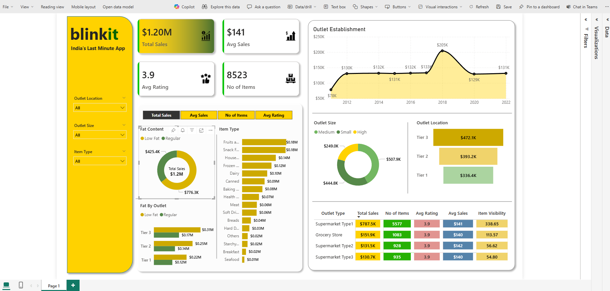

# Overview
### This repository contains the Power BI report for Blinkit, a data visualization project aimed at analyzing key metrics and performance indicators. The report provides insights into various aspects of the business, including sales, customer behavior, and operational efficiency.

# Key Features
### Interactive Dashboards: The Power BI report includes interactive dashboards that allow users to explore data dynamically.
### Key Metrics: The report highlights important metrics such as sales performance, customer demographics, and operational efficiency.
### Visualizations: The report uses a variety of vis

# Visualizations Included
### Sales Performance:
   Monthly sales trends.
   Top-selling products.
   Revenue by region.
   
##Customer Insights:
  Customer demographics (age, gender, location).
  Customer lifetime value (CLV).

##Operational Efficiency:
  Delivery times and fulfillment rates.
  Inventory turnover rates.

